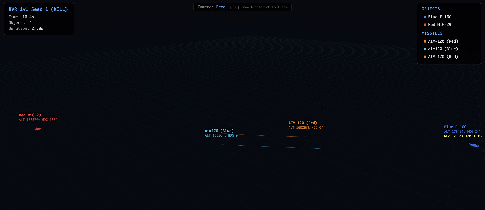

# ACMI Tacview 3D Viewer

Tacview ACMI 2.1 flight recording files을 웹 브라우저에서 3D 재생하는 뷰어.



## Quick Start

`index.html`을 브라우저에서 열고 `.acmi` 파일을 드래그앤드롭.

```bash
open index.html
```

## Controls

| Key | Action |
|-----|--------|
| `Space` | Play / Pause |
| `+` / `-` | 배속 조절 (0.25x ~ 16x) |
| `R` | 처음으로 되돌리기 |
| `ESC` | 자유 카메라 모드 |
| `Double-click` | 항공기 추적 모드 |
| Mouse drag | 카메라 회전 |
| Scroll | 줌 |

## Features

- **3D 재생** — Three.js 기반, 빌드 도구 없이 단일 HTML
- **항공기/미사일 형상** — 델타윙 전투기 + 다트형 미사일 (로폴리)
- **팀 색상** — Blue/Red 항공기, Cyan/Orange 미사일
- **비행 궤적** — 트레일 라인 표시
- **HUD 라벨** — 기체명, 고도, 헤딩, 전술 라벨 (NEZ/LAR/NFZ)
- **이벤트 표시** — FOX3 발사, SPLASH ONE 격추, HIT 피격
- **폭발 이펙트** — 격추/피격 시 파티클 버스트
- **타임라인** — 슬라이더로 자유 탐색, 뒤로 감기 지원

## ACMI Format

[Tacview ACMI 2.1](https://www.tacview.net/documentation/acmi/) 텍스트 포맷 지원.

```
FileType=text/acmi/tacview
FileVersion=2.1
#0.00
A0100,T=lon|lat|alt|roll|pitch|yaw,Name=Blue F-16C,Type=Air+FixedWing,Color=Blue
#1.00
A0100,T=lon|lat|alt|roll|pitch|yaw
F0001,T=lon|lat|alt,Name=aim120 (Blue),Type=Air+Missile,Color=Cyan
-F0001                              ← 미사일 소멸
0,Event=Message|A0100|SPLASH ONE!   ← 이벤트
```

## Stack

- HTML + vanilla JS (single file)
- [Three.js](https://threejs.org/) r160 (CDN)

## File Structure

```
ACMIViewer/
├── index.html            ← 뷰어 (단일 파일)
├── tacview_export/        ← 샘플 ACMI 파일
│   ├── bvr_seed0_altitude_advantage_kill.acmi
│   ├── bvr_seed1_offset_30_kill.acmi
│   ├── bvr_seed2_head_on_kill.acmi
│   ├── bvr_seed4_bvr_to_wvr_draw.acmi
│   ├── bvr_seed13_bvr_to_wvr_death.acmi
│   └── bvr_seed17_bvr_to_wvr_kill.acmi
└── README.md
```
